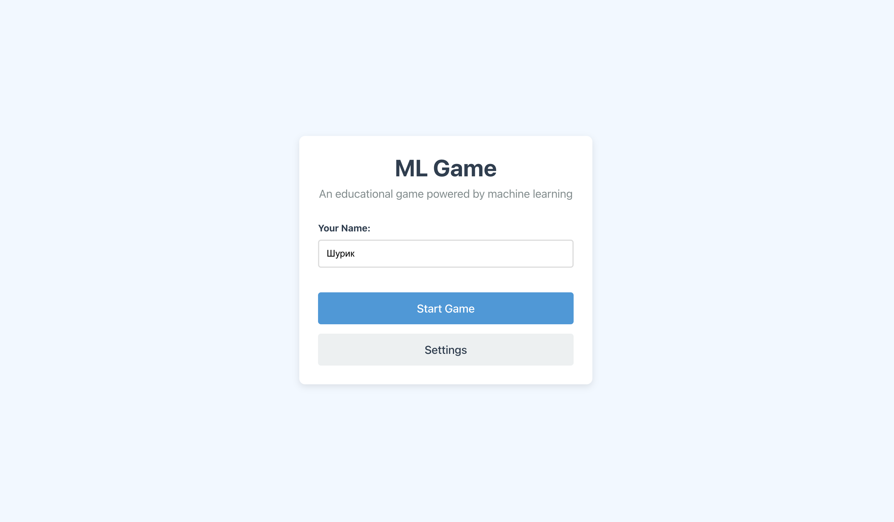

# Проект игры с генерацией заданий и оценкой ответов методами машинного обучения

Проект дает возможность улучшения знаний в области машинного обучения  и статистики в игровой форме.

## Компоненты

### Бэкенд (`backend/`)

-   **Технологии:** Python, FastAPI, PyTorch/Transformers, Hydra, MLflow, DVC, Poetry.
-   **Генерация Вопросов:** Использует дообученную модель T5 для генерации вопросов на основе конкретных тем (например, "ROC-кривая", "Теорема Байеса").
-   **Оценка Ответов:** Применяет дообученную модель Cross-Encoder для автоматической оценки ответов пользователей по шкале относительно эталонных ответов.
-   **API вопросов/ответов:** См. [README бэкенда](./backend/README.md) по настройке и обучению.

### Фронтенд (`frontend/`)

-   **Технологии:** React, TypeScript, Vite, MobX, CSS.
-   **Подробности:** См. [README фронтенда](./frontend/README.md) по настройке и запуску.

## Игровой процесс

Игроки соревнуются друг с другом в викторине улучшая знание статистики и машинного обучения (дообучить можно под любую тему)

1. **Вопросы:** Игрокам один за другим генерируются вопросы моделью на бэкенде.
2. **Ответ:** Игроки за ограниченное время должны на них отвечать.
3. **Оценка:** Полученные ответы оцениваются моделью от 0 (неверно) до 3 (полностью верно). Баллы накапливаются в течение игры.
4. **Победитель:** Выигрывает игрок с наибольшим количеством баллов по итогу.

*Стартовый экран:*

*Игровой процесс:*

