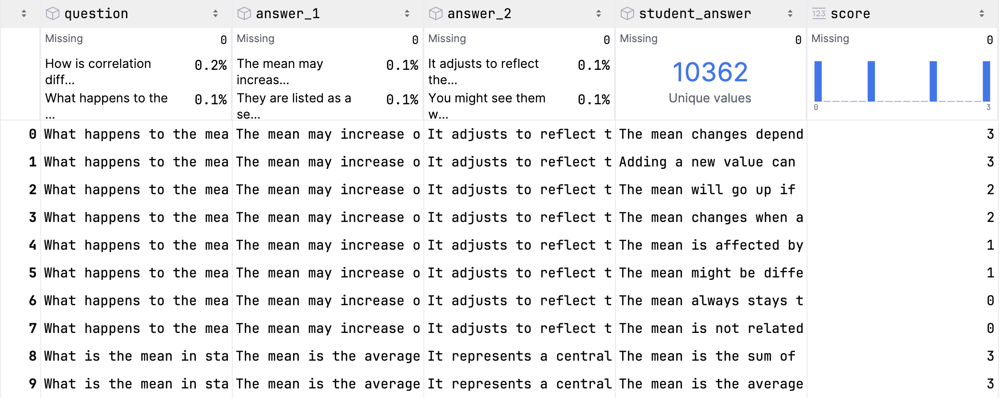
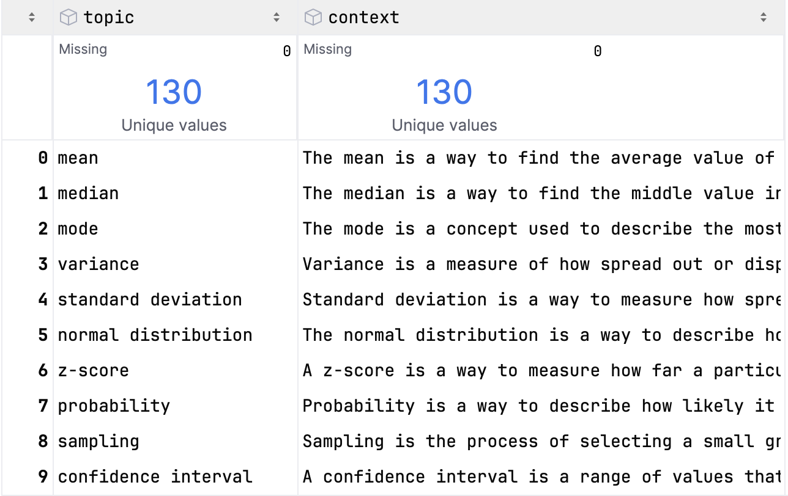
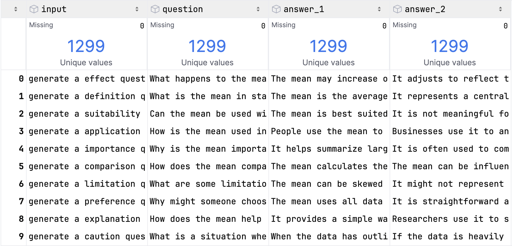
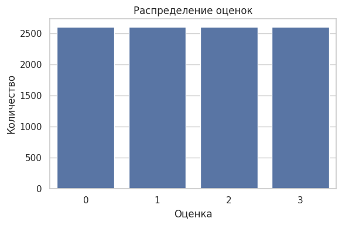
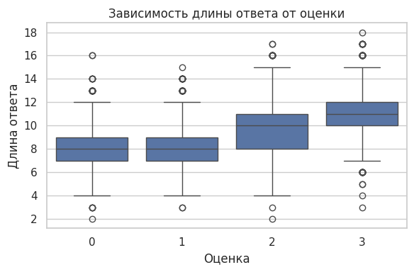
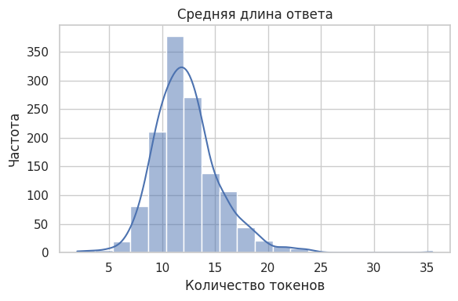

# 📊 Анализ данных (EDA)

Структура и распределение данных полученных в результате предварительного анализа.

---

## 📁 Структура данных

### 🔸 Классификатор вопросов

- Содержит вопрос, два эталонных ответа (контекст для классификатора), неэталонный ответ и оценку (0–3).

---

### 🔸 Контексты по топикам для генерации

- Содержит топик и краткое определение для дополнения генерации вопросов контекстом.

---

### 🔸 Генерация вопросов

- Содержит  промпт для генерации вопроса, вопрос и два эталонных ответа.

---

## 📌 Распределение оценок

- Оценки сбалансированы (0–3), что исключает необходимость в взвешивании классов при обучении.

---

## 📌 Длина ответа и оценка

- Более длинные ответы чаще получают высокие оценки.

---

## 📌 Длина ответов

- Большинство ответов имеют длину 8-14 токенов, распределение почти нормальное

---

